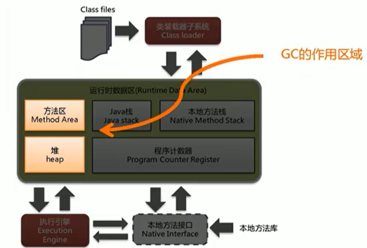
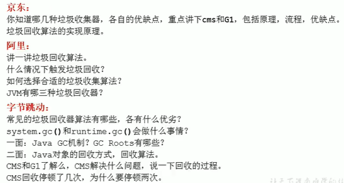

# 垃圾回收

## 1. 垃圾回收概述

### 什么是垃圾

垃圾是指在**运行程序中没有任何指针指向的对象**。

### 为什么要有GC？

1. 内存迟早会被消 耗完
2. 清除内存里的记录碎片，JVM将整理出内存分配给新的对象
3. 没有GC就不能保证应用程序的正常进行

### JAVA垃圾回收机制

自动内存管理，**降低内存泄漏和内存溢出**的风险



## 2. 垃圾回收算法

### 2.1 标记阶段


#### 2.1.1 引用计数算法 

垃圾标记阶段：区分出内存中哪些是存活对象，哪些是死亡对象，只有被标记为死亡的对象，最后才会被释放所占的内存空间。

引用计数算法（Reference Counting）：对每个对象保存一个**整型的引用计数器属性**，用于记录对象被引用的情况。

只要被引用，计数器+1，引用失效，计数器-1，当为0时，即可进行回收。

优点：实现简单，垃圾对象便于标识，判定效率高，回收没有延迟性。

缺点：

	1. 增加了存储空间的开销。
	2. 加法减法，增加了时间开销。
	3. 无法处理循环引用的情况。

> Python采用了这种算法，Java没有采用
>
> Python采用了weakref解决循环引用。

#### 2.1.2 可达性分析算法

又称为根搜索算法、追踪性垃圾收集

> “GC Roots”根集合就是一组必须活跃的引用

##### 基本思路

1. 以根对象集合为起始点，按照从上至下的方式 **搜索被根对象集合所连接的目标对象是否可达**。
2. 使用可达性分析算法后，内存中**只有存活的对象**会被根对象集合直接或间接**连接**着，搜索走过的路劲被称为**引用链**
3. 不可达的对象，可以被标记为垃圾对象。

##### GC Roots包含的元素

1. 虚拟机栈中引用的对象

2. 本地方法栈内JNI引用的对象

3. (方法区)类静态属性引用的对象

4. (方法区)常量引用的对象

5. 所有被同步锁synchronized持有的对象

6. Java虚拟机内部的引用（基本数据类型对应的Class对象，类加载器）

7. 反映Java虚拟机内部情况的JMXBean、JVMTi中注册的回调、本地代码缓存

8. 除了固定的GC Roots集合以外，根据用户所选用的垃圾收集器以及当前回收的内存区域不同，**还可以有其他对象“临时性”地加入**，共同构成完整的GC Roots集合，比如：**分代收集和局部回收（Partial GC）**

   > - 如果只针对Java堆中的某一块区域进行垃圾回收（比如：典型的只针 对新生代）， 必须考虑到内存区域是虚拟机自己的实现细节，更不是孤立封闭的， 这个区域的对象完全有可能被其他区域的对象所引用，这时候就需要一并将关联的区域对象也加入GC Roots集合中去考虑，才能保证可达性分析的准确性。

由于Root采用栈方式存放变量和指针，如果一个指针，它保存了堆内存里面的对象，但自己又不在堆内存里面，那么它就是一个Root。

##### 注意

- 如果使用可达性分析算法，那么分析工作必须在能保障一致性的快照中进行的。
- 这也是导致GC是必须“Stop The World”的一个重要原因

#### 2.1.3 对象finalization的机制

##### 概述

Java语言提供了对象终止（finalization）机制，来允许开发人员**提供对象被销毁之前的自定义处理逻辑。**

 对象被回收之前，先调用这个对象的finalize()方法

finalize()方法可被重写，**用于在对象被回收时，进行资源释放**。

##### 不要主动调用finalize的理由

> 永远不要主动调用finalize()方法，应该交给垃圾回收机制。

1. finalize()时可能会导致对象复活
2. finalize()方法的执行时间是没有保障的，它完全由GC线程决定，极端情况下，若不发生GC，则finalize()方法将没有执行的机会
3. 一个糟糕的finalize()会严重影响GC性能。

> 从功能上来说，finalize()方法与C++中的析构函数比较相似，但Java采用的是基于垃圾回收器的自动内存管理机制。所以finalize()在本质上不同于C++中的析构函数。

##### 虚拟机中对象可能处于的状态

1. 可触及的：从根节点开始，可以达到这个对象
2. 可复活的：对象的所有引用都被释放，但是对象有可能在finalize()中复活。
3. 不可触及的：对象的finalize()的调用，并且没有复活，那么就会进入不可触及状态。**不可触及状态不可复活**，**因为finalize只能调用一次**。

##### 具体过程

 	1. 如果对象objA到GC Roots没有引用链，则进行一次标记
 	2. 判断此对象有没有必要执行finalize方法
 	 1. 如果没有重写finalize或者执行过一次finzlize方法，则被虚拟机视为“没有必要执行”，objA被判断为不可触及的
 	 2. 如果对象objA重写了finalize方法，但还未执行过，那么objA会被插入到F-Queue队列中，由一个虚拟机自动创建的、低优先级的Finalizer线程触发器finalize方法的执行。
 	 3. **finalize方法是对象逃脱死亡的最后机会**，稍后GC会对F-Queue队列中的对象进行第二次标记。**如果objA在finalize()方法中与引用链上的任何一个对象建立的联系**，那么在第二次标记时，objA会被移除“即将回收”集合。之后，如果对象再次出现没有引用存在的情况下，finalize方法不会被调用，对象会直接变成不可触及的状态（**一个对象的finalize方法只会被调用一次**）

-XX:+HeapDumpOnOutOfMemory //heap OOM时，生成dump文件

### 2.2 清除阶段

#### 2.2.1 标记-清除算法

Mark-sweep

##### 执行过程

当堆中的有效空间被耗尽的时候，就会停止整个程序（Stop The World），然后进行标记和清除

- 标记：Collector从引用根节点开始遍历，标记所有被引用的对象，一般是在对象的Header中记录为可达对象
- 清除：Collector对堆内存从头到尾进行线性的遍历，如果发现某个对象在期Header中没有标记为可达对象，则进行回收

##### 缺点：

- 效率不算高
- 在进行GC时，需要停止整个应用程序
- 这种方式清理出来的空闲内存是不连续的，会产生内存碎片，需要维护一个空闲列表。

##### 注意：何为清除？

> 这里所谓的清除并不是真的置空，而是把需要清除的对象的地址，保存在空闲列表里，下次有新对象需要加载时，判断垃圾的位置空间是否足够，如果够就直接覆盖（不够，可能会报OOM）

#### 2.2.2 复制算法

##### 执行过程

将活着的内存空间分为两块，每次只使用其中的一块，在垃圾回收时，将正在使用的内存中的存活对象复制到未被使用的内存块中，之后清除正在使用的内存块中的所有对象，交换两个内存的角色，最后完成垃圾回收。

##### 优点：

- 没有标记和清除过程，简单，运行高效
- 复制过去保证空间连续，不会出现碎片

##### 缺点：

- 需要两倍的内存空间
- 对于G1这种拆分为大量region的GC，复制而不是移动，意味着GC需要维护region之间的引用关系，不管是内存占用还是时间开销也不小

##### 特别的：

如果系统中的**非垃圾对象特别多**，复制算法**不会很理想**。因为复制算法需要复制的存活对象数量并不会太大或者说非常低才行。

只有存活对象少的情景下才适合该算法，例如新生代。

#### 2.2.3 标记-压缩算法

标记整理算法、Mark-Compact

> 标记-压缩算法适用于老年代。

##### 执行过程

1. 第一阶段和标记-清除算法一样，从根节点开始标记所有被引用的对象。
2. 将所有的存活对象压缩到内存的一段，按顺序排放。
3. 清理边界外所有的空间。

##### 优点

- 消除了标记-清除算法中，内存区域分散的缺点，给新对象分配内存时，JVM只需要有一个内存的起始地址即可
- 消除了复制算法中，内存减半的代价

##### 缺点

- 效率低于复制算法
- 移动对象时，如果对象被其他对象引用，还需要调整引用的地址
- 移动过程中，需要全程暂停用户应用程序，即STW

|          | Mark-Sweep         | Mark-Compact     | Copying                               |
| -------- | ------------------ | ---------------- | ------------------------------------- |
| 速度     | 中等               | 最慢             | 最快                                  |
| 空间开销 | 少（但会积累碎片） | 少（不堆积碎片） | 通常需要活对象的2倍大小（不堆积碎片） |
| 移动对象 | 否                 | 是               | 是                                    |

### 2.3 分代收集算法

Generation Collecting

不同生命周期的对象可以采取不同的收集方式，以便提高回收效率。

一般是把Java堆分为新生代和老年代，根据各个年代不同的特点使用不同的回收算法

1. 年轻代

   特点：区域相对于老年代小、对象生命周期短、存活率低、回收频繁

   针对这种特点，适合**复制算法**，复制算法的效率只和当前存活对象的大小有关，内存率运用不高的问题也通过survivor区缓解

2. 老年代

   特点：区域大、对象生命周期长、存活率高、回收不频繁

   一般由标记-清除或者标记-整理算法混合使用

   Mark阶段开销与存活的对象数量成正比

   Sweep阶段的开销与所管理区域的大小成正比

   Compact阶段的开销与存活对象的数据成正比

    CMS时基于Mark-Sweep实现的，对于对象的回收效率很高，对于碎片问题，CMS采用基于Mark-Compact算法的Serial Old回收器作为补偿：当内存回收不佳（碎片导致的Concurrent Mode Failure时），将采用Serial Old执行Full GC 以达到对老年代内存的整理

### 2.4 增量收集 算法

incremental collecting，解决STW造成应用程序挂起很久的问题

#### 基本思想

垃圾收集线程只收集一小片区域的内存空间 ，接着切换到应用程序线程，依次反复，直到垃圾收集完成

增量收集算法的基础，仍然是标记-清除和复制算法，增量收集算法通过

对线程间冲突的妥善处理，允许垃圾收集线程以分阶段的方式完成标记、清理或复制工作。

#### 缺点

因为线程切换和上下文 转换的消耗，会使得垃圾回收的总体成本上升，造成系统吞吐量的下降

### 2.5 分区算法

为了更好的控制GC产生的停顿时间 ， 将一块大内存划分成多个小块，根据目标停顿时间，每次合理地回收若干个小区间。

分代算法将按照对象的生命周期划分成两部分，分区算法将整个堆空间划分成连续的不同小区间。

每个小区间独立使用，独立回收。

## 3 垃圾回收相关概念

### System.gc()

通过System.gc或者Runtime.getRuntime().gc()的调用，会显示触发Full GC，同时对老年代和新生代进行调用。

JVM实现者可以通过System.gc()调用来决定JVM的GC，但一般不这样。

System.gc()======》提醒JVM的垃圾回收器执行GC，但不确定是否马上执行

System.runFinalization（）；//强制调用使用引用对象的finalize（）方法

### 内存溢出(OOM)

OutOfMemory：没有空闲内存、并且垃圾收集器也无法提供更多内存。

没有空闲内存？

- Java虚拟机的堆内存设置不够
- 代码创建了大量大对象，并且长时间不能被垃圾收集器收集（存在被引用）

在OOM之前，通常垃圾收集器会被触发，例如：

- 在引用机制中分析中，涉及到JVM会去尝试回收**软引用指向的对象**等。
- 在java.nio.BIts.reserveMemory()方法中，System.gc()会被调用

特殊：

- 分配超大对象，超过堆的最大值，直接抛出OOM

### 内存泄漏(Memory Leak)

只有对象不会被程序用到了，但GC又不能回收他们的情况，才叫内存泄漏。（严格意义）

#### 举例

1. 单例模式

   单例的生命周期和应用程序一样长，如果在单例程序中，持有对外部对象的引用的话，那么这个外部对象是不能回收的，会导致内存泄漏的发生

2. 一些提供close的资源未关闭，导致内存泄漏

   数据库连接(dataSource.getConnection())，网络连接(socket)和io连接，必须手动close，否则不能被回收

### Stop The World

GC事件发生过程中，会产生应用程序的停顿，  **停顿产生时整个应用程序线程都会被暂停，没有任何响应**。这个过程称为STW。

可达性分析算法中枚举根节点（GC Roots），会导致STW。

STW是JVM在后台**自动发起和自动完成**的。

### 垃圾回收的并行与并发

#### 程序的并行与并发

并发（Concurrent）：**一个时间段**中，有几个程序都处于已启动运行到运行完毕之间，且都是在同一个处理器上运行的。（**指多个事情，在一个时间段内同时发生**）

并行（Parallel）：当系统有一个以上CPU时，当一个CPU执行一个进程时，另一个CPU可以执行另一个进程，两个进程互不抢占资源，可以同时进行，称之为并行。（**指多个事情，在一个时间点内同时发生**）

并发的多个任务之间互相抢占资源。

并行的多个任务之间不互相抢占资源。

只有在多个CPU或一个CPU多核时，才会发送并行

否则都是并发

#### 垃圾回收的并行与并发

- 并行（Parallel）：指**多条垃圾收集线程并行工作**，但用户线程仍处于等待状态

  > 如parNew、Parallel Scavenge 、 Parallel Old

- 串行（Serial）：

  > - 单线程执行
  > - 如果内存不够，程序暂停，启动JVM垃圾回收器进行垃圾回收

- 并发（Concurrent）：指用户线程与垃圾回收线程同时执行（并不一定是并行），垃圾回收线程在执行时并不会停顿用户程序的执行。

#### 安全点与安全区域

##### 安全点

程序执行时，并非在所有地方都能停顿下来开始GC，只有在特定的位置才能停顿下来开始GC，这些位置称为“安全点（Safepoint）”。

Safepoint的选择很重要。如果太少，可能导致GC等待时间过长；如果太频繁，可能会导致运行时的性能问题。

Safepoint选择标准：“**是否具有让程序长时间执行的特征**”，比如，方法调用、循环跳转、异常跳转

###### 如何在发生GC的时候，检查所有线程都跑到最近的安全点停顿下来？

- 抢先试中断：（目前没有虚拟机采用了）

  首先中断所有线程，如果有的线程不在安全点，就恢复线程，让线程跑到安全点

- 主动式中断：

  设置一个中断标志，各个线程运行到Safepoint的时候主动轮询这个标志，如果中断标志位真，则将自己进行中断挂起

##### 安全区域

解决线程处于Sleep或Block状态，无法响应JVM的中断请求

安全区域（Safe Region）是**指在一段代码片段中，对象的引用关系不会发生变化，在这个区域中的任何位置开始GC都是安全的**。

###### 执行过程

1. 当线程运行到Safe Region的代码时，首先标识已经进入了Safe Region，如果这段时间内发生GC，JVM会忽略标识Safe Rgion状态的线程；
2. 当线程即将离开Safe Region时，会检查JVM是否已经完成GC，如果完成了，继续运行，否则线程必须等待直到收到可以安全离开的Safe Region的信号为止。

#### 引用

##### 概述

强引用、软引用、弱引用、虚引用，这**四种引用强度一次逐渐减弱**。

1. 强引用（Strong Reference）：最传统的“引用”的定义，即`Object obj = new Object()`，**只要强引用关系还存在， 垃圾收集器就永远不会回收掉被引用的对象。**

2. 软引用（Soft Reference）：在系统将要发生内存溢出之前，将会把这些对象列入回收范围之中进行第二次回收。如果回收后还没有足够的内存，才会OOM。**内存不够就回收。**
3. 弱引用（Weak Reference）：被弱引用关联的对象只能生存在下一次垃圾回收之前。**只要垃圾回收器工作，无论内存是否足够，都会被回收**。
4. 虚引用（Phantom Reference）：该引用不会对对象的生存时间构成影响，也无法通过虚引用获得一个对象的实例。设置虚引用的目的，**希望在对象被回收器回收时收到一个系统通知。**  

##### 强引用（Strong Reference）

强引用的对象是可触及的，垃圾收集器永远不会回收掉被引用的对象。

强引用是造成内存泄漏的主要原因之一。

##### 软引用（Soft Reference）

软引用的对象是软可触及的，内存不足就将会把这些对象列入回收范围之中进行第**二次回收**。

> 第一次回收是指，回收不可触及的对象
>
> 内存够时，不会回收软引用的可达对象
>
> 内存不够时，会回收软引用的可达对象

```java
//声明强引用
Object obj = new Object(); 
//声明软引用
SoftReference<Object> sf = new SoftReference<Object>(obj);
//销毁强引用，这样obj就只剩一个软引用了，就是一个软引用对象了
obj = null;

```

###### 应用

通常来实现内存敏感的缓存。比如，高速缓存（有了空闲内存就保留缓存，内存不足就清理掉）

##### 弱引用（Weak Reference）

弱引用的对象是弱可触及的，发现即回收。**只**被弱引用关联的对象，**只**能生存到下一次垃圾手机发生为止。

> 弱引用可能存在较长时间。（由于垃圾回收器的线程通常优先级很低）

```java
//声明强引用
Object obj = new Object(); 
//声明弱引用
WeakReference<Object> sf = new WeakReference<Object>(obj);
//销毁强引用，这样obj就只剩一个弱引用了，就是一个弱引用对象了
obj = null;

```

###### 应用

软引用和弱引用都非常适合来保存那些可有可无的缓存数据。

题：你用过WeakHashMap吗？（实现了WeakReference）

##### 虚引用（Phantom Reference）

虚引用的对象是虚可触及的，对象回收跟踪。一个对象的虚引用，完全不会决定对象的生命周期。

> 它不能单独使用，也无法通过虚引用获取被引用的对选哪个，当用虚引用的get方法时，返回的总是null。
>
> 虚引用必须和引用队列一起使用，虚引用在创建时，必须提供一个引用队列作为参数。
>
> 当垃圾回收器准备回收一个对象时，如果发现它还有虚引用，就会在回收对象后，将这个虚引用加入引用队列，以通知应用程序对象的回收情况。

```java
Object obj = new OBject();
ReferenceQueue phantomQueue = new ReferenceQueue();
PhantomReference<Object> pf = new PhantomReference<Object>(obj,phantomQueue);
obj = null;
```

为一个对象设置虚引用关联的唯一目的在于跟踪垃圾回收过程， 能在这个对象被收集器回收时收到一个系统通知。

###### 应用

**由于虚引用可以跟踪对象的回收事件，因此，也可以将一些资源释放操作放置在虚引用的执行和记录。**

##### 终结器引用（Final Reference）

它用以实现对象的finalize()方法

无需手动编码，其内部去配合引用队列使用

在GC时，终结器引用 入队，由Finalizer线程通过终结器引用找到被引用对象并调用它的finalize()方法，第二次GC时，才能回收被引用对象。

## 4. 垃圾收集器

### 4.1 垃圾回收器分类

- 按线程分：
  - 串行垃圾回收器
  - 并行垃圾回收器

- 按工作模式分：
  - 并发式垃圾回收器：垃圾回收器与应用程序线程交替工作
  - 独占式垃圾回收器：一旦运行，就停止应用程序中所有用户线程，直至垃圾回收完成

- 按碎片处理方式分：
  - 压缩式垃圾回收器：垃圾回收完后，对存活的对象进行压缩整理，消除碎片
    - 再分配对象空间：指针碰撞
  - 非压缩式垃圾回收器
    - 再分配对象空间：空闲列表

- 按工作的内存区间分
  - 年轻代垃圾回收器
  - 老年代垃圾回收器

### 4.2 评估GC的性能指标

#### 4.2.1 概述

**吞吐量：运行用户代码的时间占总运行时间的比例**

 垃圾收集开销：吞吐量的补数，垃圾收集所用时间与总运行时间的比例

**暂停时间：执行垃圾收集时，程序的工作线程被暂停的时间。**

收集频率：相对于应用程序的执行，收集操作发生的频率。

**内存占用：Java堆区所占的内存大小。**

快速：一个对象从诞生到被回收所经历的时间。

#### 4.2.2 吞吐量（throughput）

高吞吐量，意味着单次STW比较长。（单位时间内STW最短）

​					也意味着内存回收的评率低。

#### 4.2.3 暂停时间（pause time）

暂停时间优先，意味着尽可能让单次STW的时间最短。

​								也意味着内存回收的评率高。

**现在标准：在最大吞吐量优先的情况下，降低停顿时间。**

### 4.3 Java常见的垃圾收集器

- 串行回收器：Serial、Serial Old
- 并行回收器：ParNew、Parallel Scavenge、Parallel Old
- 并发回收器：CMS、G1


##### 4.3.1 垃圾收集器的组合关系


###### 注意

- JDK1.3到1.5默认使用SerialGC + SerialOldGC
- JDK1.6到1.8默认是ParallerlGC + parallerlOldGC
- JDK9及以后默认使用G1
- CMS在9之后过期，14之后被移除

###### 说明

1. 两个收集器间有连线，表明它们可以搭配使用
2. 其中Serial 0ld作为CMS 出现"Concurrent Mode Failure"失败的后 备预案。
3. （红色虚线）由于维护和兼容性测试的成本，JDK8过时，JDK 9中移除。
4. （绿色虚线）JDK 14中：过时 未来会移除
5. （青色虚线）JDK 14中：删除CMS垃圾回收器

- 为什么要有很多收集器个不够吗？ 因为Java的使用场景很多， 移动端，服务器等。所以就需要针对不同的场景，提供不同的垃圾收集器，提高垃圾收集的性能。

###### 查看默认的垃圾收集器

- -XX：+PrintCommandLineFlags： 查看命令行相关参数（包含使用的垃圾收集器）
  - JDK1.8结果: +UseParallelGC +UseParallelOldGC
  - JDK11结果：+UseG1GC
- 使用命令行指令： jinfo -flag相关垃圾回收器参数进程ID

### 4.4 Serial回收器：串行回收

#### 概述

Serial 收集器采用**复制算法、串行回收和“STW”机制**的方式执行内存回收。（用于年轻代）

Serial Old 收集器同样采用了**串行回收和“STW”机制**，只不过 内存回收算法使用的是**标记-压缩算法**（用于老年代）

- Serial Old 在Client模式下，默认是老年代的垃圾回收器
- 在Server模式下，与新生代Parallel Scavenge配合使用，作为老年代CMS收集器的后背垃圾收集方案
- 在HotSpot虛拟机中，使用`-XX:+UseSerialGC `表示年轻代使用SerialGC和老年代使用SerialOldGC收集器

#### 特点

- 单线程

- 进行垃圾收集时，必须暂停其他所有的工作线程，直到它收集结束


#### 优势

- 简单而高效（与其他收集器的单线程比），没有线程交互的开销

- 在用户的桌面应用场景中，可用内存一般不大（几十MB至一两百MB）， 可以在较短时间内完成垃圾收集（几十ms至一百多ms） ，只要不频繁发生，使用串行回收器是可以接受的。

### 4.5 ParNew回收器：并行回收

#### 概述

> 是Serial收集器的多线程版本，Par-》Parallel，New：只能处理新生代

ParNew收集器采用**复制算法、“STW”机制、并行回收**的方式

- 对于新生代，回收次数频繁，使用并行方式高效


> 由于ParNew收集器是基于并行回收，那么是否可以断定ParNew收集器的回收效率在任何场景下都会比Serial收集器更高效？
>
> - ParNew在多CPU场景下，更高效
>
> - 在单个CPU环境下，ParNew收集器不比Serial收集器更高效

- 通过选项`-XX:+UseParNewGC`手动指定使用ParNew收集器执行内存回收任务。它表示年轻代使用并行收集器，不影响老年代。
- `-XX:ParallelGCThreads`限制线程数量，默认开启和CPU数据相同的线程数。

### 4.6 Parallel Scavenge回收器：吞吐量优先

#### 概述

吞吐量优先

Parallel Scavenge收集器采用**复制算法、并行回收和“STW”机制**

Parallel Old收集器采用**标记-压缩算法、并行回收和“STW”机制**

> Parallel收集器的出现是否多次一举？
>
> - 和ParNew收集器不同，Parallel Scavenge收集器的目标时达到一个**可控制的吞吐量**（Throughput），也被称为吞吐量优先的垃圾收集器
> - 自适应调节策略也是Paralle Scavenge与ParNew的区别

#### 特点

高吞吐量适合场景：在**后台运算**而不需要太多的交互任务，例如执行批量处理、订单处理、工资支付、科学计算的应用

#### 参数配置

- -XX:+UseParallelGC：手动指定年轻代使用Parallel并行收集器执行内存回收任务。默认配套使用UseParallelOldGC。
- -XX:+UseParallelOldGC：手动指定老年代使用并行回收收集器。JDK8默认开启。
- -XX:ParallelGCThreads：设置年轻代并行收集器的线程数，最好与CPU数量相等。（默认开启）
  - 默认情况下，当CPU数< 8 时，ParallelGCThreads的值等于CPU数量
  - 当CPU数量大于8，ParallelGCThreads的值等于 3 +[ 5*CPU_Count / 8]
- -XX:MaxGCPauseMillis：设置垃圾收集器最大停顿时间（即STW的时间），单位是毫秒
- -XX:GCTimeRatio：垃圾收集时间占总时间的比列，用于衡量吞吐量的大小。
  - 取值范围:(0,100)，默认99，即垃圾回收时间不超过1%。
  - 与MaxGCPauseMillis冲突

- -XX:+UseAdaptiveSizePolicy：设置Parallel Scavenge收集器具有**自适应调节策略**
  - 年轻代的大小、Eden、survivor的比例、晋升老年代对象的年龄会被自动调整
  - 在手动调优比较困难的场合，可以直接使用这种自适应策略，仅指定最大堆、目标的吞吐量和停顿时间，让虚拟机自己完成调优 

### 4.7 CMS回收器：低延迟（9废弃，14移除）

Concurrent-Mark-Sweep

#### 概述

- 低延迟优先
- CMS回收器采用**并发回收、标记-清除算法、“STW”机制**
- 第一次实现了让垃圾收集线程与用户线程同时工作

- 关注点是尽可能缩短垃圾收集时用户线程的停留时间
- 应用：网站或者B/S系统的服务端，这类重视服务的响应速度
- CMS作为老年代的收集器，无法与新生代的Parallel Scavenge配合，只能选择ParNew或Serial

#### CMS工作原理


主要分为4个阶段：初始标记阶段、并发标记阶段、重新标记阶段、并发清除阶段

1. 初始标记（Initial-Mark）阶段：程序中所有的工作线程都会因为“STW”机制而出现短暂的暂停，主要任务是**标记GC Roots能直接关联到的对象**。由于直接关联的对象比较小，所以**速度非常快**。
2. 并发标记（Concurrent-Mark）阶段：从GC Roots的**直接关联对象开始遍历整个对象图**的过程，这个**过程耗时长**，但**不需要停顿用户线程**，用户线程与垃圾线程并发执行。
3. 重新标记（Remark）阶段：**修正并发标记期间，因用户程序继续运作而导致标记产生变动的那一部分对象的标记记录。**这个阶段耗时比初始阶段稍长，比并发标记阶段短。
4. 并发清除（Concurrent-Sweep）阶段：**此阶段清理删除掉标记阶段判断的已经死亡的对象，释放内存空间。**此阶段也是与用户线程并发执行的

#### 特点

- 由于最耗时的并发标记和并发清除阶段都不需要暂停工作，所以整体的回收是**低延迟**的。
- 由于垃圾收集阶段用户线程没有中断，**在CMS回收过程中，还应该确保应用程序用户线程有足够的内存可用**。
- 当堆内存的使用率达到某一阈值是，便开始进行回收。
- 如果CMS运行期间预留的内存无法满足程序需要，就会出现“Concurrent Mode Failure”，启动后备预案，临时启用Serial Old收集器来重新进入老年代的垃圾收集。

#### 缺陷

- 由于CMS采用标记-清除算法，将**会产生内存碎片**，为新对象分配内存时**只能采用空闲列表法**。在无法分配大对象的情况下，不得不**提前触发Full GC**。
- **CMS收集器对CPU资源非常敏感。**在并发阶段，虽不会导致用户停顿，但会因为占用了一部分线程而导致应用程序变慢，总吞吐量降低。
- **CMS收集器无法处理浮动垃圾**。可能会导致“Concurrent Mode Failure”触发Full GC。**在并发阶段如果产生新的垃圾对象，CMS将无法对这些垃圾对象进行标记，最终会导致这些新产生的垃圾对象没有被及时回收**，只能在下一次执行GC时释放之前未被回收的内存空间。

>  既然Mark Sweep会造成内存碎片，那为什么不把算法换成Mark Compact？
>
>  因为并发清除的时候，用Compact整理内存的话，原来的用户线程使用的内存就不能使用了。要保证用户线程能继续执行，前提是它运行的资源不受影响。Mark Compact更适合“STW”场景下的使用。

#### 参数配置

- -XX:+UseConcMarkSweepGC：手动指定使用VMS 收集器执行内存回收任务。
  - -XX： +UseParNewGc打开。即： ParNew （Young区用） +CMS （Old区用） +Serial Old(备选)的组合。
- -XX:CMSInitiatingOccupanyFraction：设置堆内存使用率的阈值，一旦达到该阈值，便开始进行回收
  - JDK5之前默认是68，JDK6之后默认是92，即老年代空间使用率达到92%就会触发。
  - 内存增长缓慢，则可以设置一个稍大的值，减少CMS发生频率；内存使用率增长很快，应该降低阈值，以减少Full GC的执行次数。

- -XX:+UseCMSCompactAtFullCollection：用于指定在执行完Full GC后对内存空间进行压缩整理，以此避免内存碎片的产生。不
- -XX:CMSFullGCsBeforeCompaction：设置在执行多少次Full GC后对内存空间进行压缩
- -XX:ParallelCMSThreads：设置CMS的线程数量
  - CMS 默认线程数是 ( ParallelGCThread +  3 ) / 4，ParallelGCThreads 是年轻代并行收集器的线程数。当CPU资源比较紧张时，受到CMS收集器线程的影响，应用程序的性能在垃圾回收阶段可能会非常糟糕。

#### 判断使用哪种GC

如果想要最小化地使用内存和并行开销，请选择Serial GC；

如果想要最大化应用程序的吞吐量，请选择Parallel GC；

如果想要最小化GC的中断或停顿时间，请选择CMS GC。	

### 4.8 G1 回收器：区域化分代式

#### 概述

- 为了适应**不断扩大的内存和不断增加的处理器数量**，进一步降低暂停时间，同时兼顾良好的吞吐量。


- G1：**在延迟可控的情况下获得尽可能高的吞吐量**，所以才当起“全功能收集器”的重任与期望。


- G1，并行回收器，**把堆内存分割为很多不相关的区域（Region）**，使用Region来表示Eden、幸存者0区、幸存者1区、老年代等。

- G1 跟踪各个Region里面的垃圾堆积的价值大小，在后台维护一个优先列表，每次根据允许的收集时间，**优先回收价值最大的Region**。

- 侧重点在于，**回收垃圾最大量的区间**（Region）
- G1，面向服务端应用的垃圾收集器，主要针对配备多核CPU及大容量内存的机器
- 除G1外，其他的垃圾收集器使用内置的JVM线程执行GC的多线程操作，G1 GC 采用**应用线程承担后台运行的GC工作**

#### 特点

##### 并行与并发

- 并行性：G1在回收期间，可以有多个GC线程同时工作，此时用户线程STW
- 并发性：G1拥有与应用程序交替执行的能力。一般不会在整个回收阶段发生完全阻塞应用程序的情况

##### 分代收集

- G1**依然属于分代型垃圾回收器**，不要求Eden区、年轻代、老年代都是连续的，也不再坚持固定大小和固定数量
- **将堆空间分为若干区域（Region），这些区域中包含了逻辑上的年轻代和老年代**
- **兼顾年轻代和老年代**（可以在这俩区GC）

##### 空间整合

- 内存回收是**以Region作为基本单位**
- **Region之间是复制算法，整体可以看做标记-压缩算法**。有利于长时间运行，利于大对象。在Java堆非常大时，优势更明显。

##### 可预测的停顿时间模型（软实时:Soft real-time）

能让使用者明确指定在长度为M毫秒的时间片段内，消耗在垃圾收集上的时间不得超过N毫秒

- G1 跟踪各个Region里面的垃圾堆积的价值大小，在后台维护一个优先列表，每次根据允许的收集时间，**优先回收价值最大的Region**。

##### 缺点

- G1为了垃圾收集产生的内存占用、程序运行时的额外执行负载比CMS高
- 在小内存应用上CMS表现会优于G1，在大内存上G1优于CMS

#### 参数设置

-XX:+UseGC ：手动指定使用G1

-XX:G1HeapRegionSize ：设置每个Region的大小，值是2的幂，范围是1-32MB，目标时根据最小的Java堆内存划分出2048个区域，默认是堆内存的1/2000

-XX:MaxGCPauseMilliis ：设置期望达到的最大GC停顿时间指标，默认是200ms

-XX: ParallelGCThread ：设置STW工作线程数的值，最多为8

-XX:ConcGCThreads ：设置并发标记的线程数，将n设置为并行垃圾回收线程数(ParallelGCThread)的1/4左右。

-XX:InitiatingHeapOccupancyPercent ：设置触发并发GC周期的Java堆占用率的阈值，超过此值，就触发GC，默认是45

#### 操作步骤

1. 开启G1
2. 设置堆的最大内存
3. 设置最大停顿时间

#### G1回收器的使用场景

- 面向服务端应用，针对具有大内存、多处理的机器
- 最主要的应用是需要低GC延迟，并具有大堆的内存应用程序；如：
  - 在堆大小约6GB或更大时，可预测的暂停时间可以低于0.5s

- 在下面情况时，G1比CMS好
  - 超过50%的Java堆被活动数据占用
  - 对象分配频率或年代提升频率变化大
  - GC停顿时间过长

#### Region：化整为零

所有的Region大小相同，且在JVM生命周期内不会改变

新生代和老年代都是一部分Region（不需要连续）的集合，通过Region的动态分配实现逻辑上的连续。

一个Region可能属于Eden、Survivor、Old区，但一个Region只能属于一种角色。

G1 垃圾收集器还增加了一种新的内存区域，叫Humongous 内存区域，主要用于存储大对象，如果超过1.5个region，就会放到Humongous。

> 设置Humongous的原因：
>
> 堆中的大对象，默认会分配到老年代，但如果它是一个短期存在的大对象，就会对垃圾收集器造成负面影响。因此，G1 划分了一个Humongous，专门存储大对象，**如果一个H区装不下一个大对象，那么G1会寻找连续的H区来存储**。有时为了能够找到连续的H区，会不得不启动Full GC，G1大多数行为都会把H区作为老年代的一部分来看待。

一个Region内部分配内存时，用指针碰撞，

线程安全，使用TLAB解决


#### G1 回收器垃圾回收过程


1. 年轻代GC (Young GC)

2. 老年代并发标记过程 (Concurrent Marking)

3. 混合回收 (Mixed GC)

4. （如果需要，单线程、独占式、高强度的Full GC还是继续存在的，对GC的评估失败提供了一种失败保护机制，即强力回收）

   

- 应用程序分配内存，**当年轻代的Eden区用尽时**，**开始年轻代回收过程**； G1的年轻代收集阶段是一个**并行**的**独占式**收集器。在年轻代回收期，G1 GC暂停所有应用程序线程，启动多线程执行年轻代回收。然后从**年轻代区间移动存活对象到Survivor区间或者老年区间**，也有可能是两个区间都会涉及。

- 当堆内存达到一定值（默认45%）时，开始老年代并发标记过程。

- 标记完成，开始混合回收过程。在混合回收时期，G1 GC 从老年区间移动存活对象到空闲区间，这些空闲区间也就成了老年代的一部分。**G1的老年代回收器不需要整个老年代被回收，一次只需要扫描/回收一部分老年代的Region就可以了**。同时，这个老年代Region是和年轻代一起被回收的。

##### 详细过程

###### ①年轻代GC

1. 扫描根

   - 根指static变量指向的对象，正在执行的方法调用链条上的局部变量，根引用链条RSet记录的外部引用作为扫描存活对象的入口

2. 更新Rset

   - 处理dirty card queue中的card，更新RSet。此阶段完成后，RSet可以准确的反映老年代对所在的内存分段中对象的引用

   - > dirty card queue
     >
     > 为什么不在引用赋值语句处直接更新RSet？
     >
     > 为了性能的需要，  RSet的处理需要线程同步，开销大，使用队列性能好很多。

3. 处理RSet

   - 识别被老年代对象指向的Eden中的对象，这些被指向的Eden中的对象被认为是存活的对象。

4. 复制对象

   - 此阶段，对象树被遍历，Eden区内存中存活的对象会被复制到Survivor区中空的内存分段，Survivor区内存段中存活的对象如果年龄未达到阈值，age+1.达到阈值的会被复制到Old区；如果Survivor空间不够，Eden区中的部分数据会直接晋升老年代

5. 处理引用

   -  处理Soft、Weak、Phantoom、JNI Weak等引用。最终Eden区数据为空，GC停止工作

###### ②并发标记过程

1. 初始标记阶段（STW）：标记从根节点直接可达的对象，这个阶段是STW，会触发一次年轻代GC
2. 根区域扫描（Root Region Scanning）：G1 GC扫描Survivor区直接可达的老年代区域对象，并标记被引用的对象，这一过程必须在Young GC 之前完成。
3. 并发标记（Concurrent Marking）：在整个堆中进行并发标记，此过程可能会被Young GC中断，在并发标记阶段 ， **若发现区域对象中的所有对象都是垃圾，那这个区域会被立即回收**。同时，并发标记过程中，会计算每个区域的对象活性（区域中存活对象的比例）
4. 再次标记（Remark，STW）：由于应用程序持续进行，需要修正上一次的标记结果。此过程STW。G1 采用了比CMS 更快的初始快照算法:snapshot-at-the-beginning（SATB）
5. 独占清理（Cleanup ，STW）：计算各个区域的存活对象和GC回收比例，**并进行排序**，**识别可以混合回收的区域**（为混合回收做准备）。此阶段STW。
6. 并发清理阶段：识别并清理完全空闲的区域

###### ③混合回收

**回收整个Young Region 和 一部分老年代。**

可以选择哪些Old Region进行收集，从而可以对垃圾回收的耗时时间进行控制。

1. 并发标记结束后，**老年代百分百为垃圾的内存分段被回收了，部分为垃圾的内存分段被计算出来**。默认情况下。这些老年代的内存分段会分8次（-XX:G1MixedGCCountTarget可设置）被回收。
2. 混合回收的**回收集包括八分之一的老年代内存分段、Eden区内存分段、Survivor区内存分段**。混合回收算法和年轻代回收算法一样，只是回收集合多了老年代的内存分段。
3. 老年代中的内存分段默认分8次回收，G1会优先回收垃圾多的内存分段。垃圾占内存分段比例越高，越会被先回收。并且一个达到阈值（-XX:G1MixedGCLiveThresholdPercent）（默认65%）就会被回收，即垃圾占内存分段的比例65%才会被回收。
4. 混合回收并不一定要进行8次。有一和阈值-XX:G1HeapWastePercent，默认10%。意思是允许整个堆内存中有10%的空间被浪费，意味着可回收的垃圾占堆内存的比例小于10%，就不会混合回收。

###### ④Full GC

> 导致G1 Full GC原因
>
> 1. Evacuation的时候没有足够的to-space来存放晋升的对象
> 2. 并发处理过程完成之前空间耗尽

 

#### 记忆集与写屏障

Remember Set、Writer Barrier

一个对象被不同区域引用的问题

是否需要扫描整个堆才正确？

解决方案：

- 无论G1还是其他分带收集器，JVM都是使用Remember Set来避免全局扫描。

- **每个Region都有一个对应的Remember Set**

- 每次Reference类型数据写操作时，都会产生一个Writer Barrier暂时中断操作

- 然后检查将要写入的引用指向的对象是否和该Reference类型数据数据在不同的Region（其他收集器：检查老年代是否引用了新生代对象）
- 如果不同，通过CardTable 把相关引用信息记录到引用指向对象所在的Region对应的Remember Set中
- 当进行垃圾收集时，GC根节点的枚举范围加入Remember Set，就可以保证不进行全局扫描，也不会有遗漏

#### G1回收器优化建议

- 年轻代大小
  - 避免使用-Xmn或
    -XX:NewRatio等相关选项显示设置年轻代大小
  - 固定年轻代的大小会覆盖暂停时间
- 暂停时间目标不要太严苛
  - G1 GC的吞吐量目标是90%的应用程序时间和10%的垃圾回收时间
  - 评估G1 GC的吞吐量时，暂停时间目标不要太严苛。目标太过严苛表示你愿意承受更多的垃圾回收开销，影响吞吐量

7款垃圾回收器总结


怎么选择垃圾回收器?

- 优先调整堆的大小让JVM自适应完成。
- 如果内存小于100M，使用串行收集器
- 如果是单核、单机程序，并且没有停顿时间的要求，串行收集器
- 如果是多CPU、需要高吞吐量、允许停顿时间超过1秒，选择并行或者JVM自己选择
- 如果是多CPU、追求低停顿时间，需快速响应（比如延迟不能超过1秒，如互联网应用），使用并发收集器
- 官方推荐G1，性能高。现在互联网的项目，基本都是使用G1。

## GC日志分析

- -XX:+PrintGC 输出GC日志。 显示总的GC堆的变化     
  - -verbose:gc

```java
[GC （Allocation Failure） 80832K一>19298K（227840K），0.0084018 secs]
[GC （Metadata GC Threshold） 109499K一>21465K （228352K），0.0184066 secs]
[Full GC （Metadata GC Threshold） 21 465K一>16716K （201728K），0.0619261 secs 
```

```java
GC、Full GC： GC的类型，GC只在新生代上进行，Full GC包括永生代，新生代， 老年代。
Allocation Failure： GC发生的原因。
80832K一> 19298K：堆在GC前的大小和GC后的大小。
228840k：现在的堆大小。
0.0084018 secs： GC持续的时间。
```

- -XX： +PrintGCDetails 输出GC的详细日志

```java
[Times： user=0.14 sys=0.00， real=0.06 secs]
```


```java
Times： user： 指的是垃圾收集器花费的所有CPU时间，sys： 花费在等待系统调用或系统事件的时间， real ：GC从开始到结束的时间，包括其他进程占用时间片的实际时间。
```

- -XX： +PrintGCTimeStamps 输出GC的时间戳（以基准时间的形式）

- -XX： +PrintGCDateStamps输出GC的时间戳（以日期的形式，如2013一05一04T21 ： 53：59.234+0800 ）

- -XX： +PrintHeapAtGC 在进行GC的前后打印出堆的信息

- -Xloggc：. . /logs/gc. log日志文件的输出路径


强引用、软引用、弱引用、虚引用有什么区别？具体使用的场景是什么？




