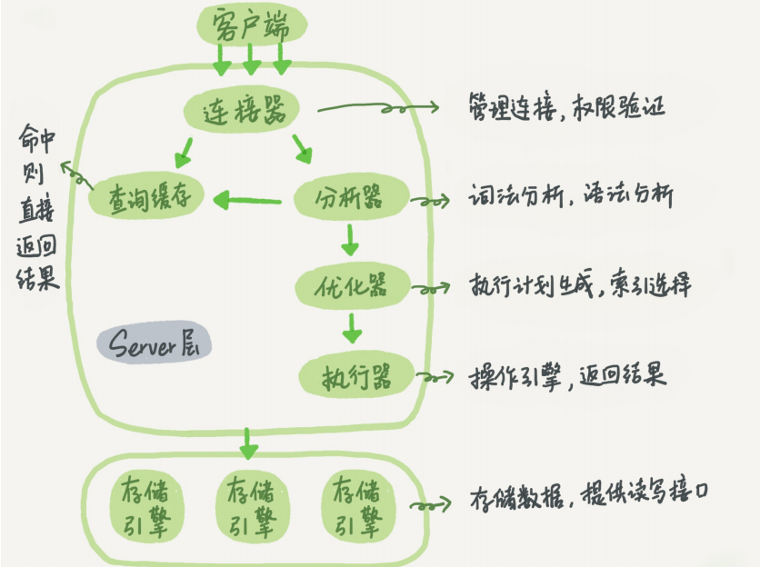

## 基础架构

MySQL可以分为 **Server层、存储引擎** 层两部分。

### Server层

Server层包括连接器、查询缓存、分析器、优化器、执行器 

存储引擎层负责数据的存储和提取。其架构模式是**插件式**的，支持InnoDB、MyISAM、 Memory等多个存储引擎。现在最常用的存储引擎是InnoDB（MySQL 5.5.5后默认）

#### 连接器

`showprocesslist`，可在Command列查看链接的状态

> 有些时候MySQL占用内存涨得特别快，这是因为 MySQL在执行过程中临时使用的内存是管理在连接对象里面的。这些资源会在连接断开的时候 才释放。
>
> 如何解决占用内存涨得特别快？
>
> 1. 定期断开长连接。使用一段时间，或者程序里面判断执行过一个占用内存的大查询后，断开 连接，之后要查询再重连。 
> 2. 如果你用的是MySQL 5.7或更新版本，可以在每次执行一个比较大的操作后，通过执行 mysql_reset_connection来重新初始化连接资源。这个过程不需要重连和重新做权限验证， 但是会将连接恢复到刚刚创建完时的状态。

#### 查询缓存(MySQL8.0删除)

- MySQL拿到一个查询请求后，会先到查询缓存看看，之前是不是执行过这条语句。
- 之前执行过 的语句及其结果可能会以key-value对的形式，被直接缓存在内存中。
- key是查询的语句，value是 查询的结果。
- 当一个表有更新时，跟这个表有关的查询缓存会失效

可以将参数query_cache_type设置成 DEMAND，这样对于默认的SQL语句都不使用查询缓存。

而对于你确定要使用查询缓存的语 句，可以用SQL_CACHE显式指定

`mysql> select SQL_CACHE * from T where ID=10`

#### 分析器

- MySQL 首先进行“词法分析”
  - 输入的是由多个字符串和空格组成的一条SQL语句，MySQL需要识别出里面的字符串分别是什么、代表什么
- 然后进行“语法分析”。
  - 根据词法分析的结果，语法分析器会根据语法规则， 判断你输入的这个SQL语句是否满足MySQL语法，

#### 优化器

- 优化器是在表里面有多个索引的时候，决定使用哪个索引；
- 在一个语句有多表关联（join） 的时候，决定各个表的连接顺序。
- 等等...

#### 执行器

 MySQL通过分析器知道了你要做什么，通过优化器知道了该怎么做，于是就进入了执行器阶段，开始执行语句。

- 开始执行时，首先判断有没有对表的相关权限
- 如果有，执行器会根据表的引擎定义，使用这个引擎提供的接口

### sredo log（重做日志）和 binlog（归档日志）

#### redo log

- 当有一条记录需要更新的时候，InnoDB引擎就会先把记录写到redo log 里面，并更新内存，这个时候更新就算完成了。同时，InnoDB引擎会在适当的时候，将这个操作记录更新到磁盘里面，而这个更新往往是在系统比较空闲的时候做。

- 有了 redo log ，InnoDB就可以保证即使数据库发生异常重启，之前提交的记录都不会丢失，这个能力称为**crash-safe**。
- redo log 是InnoDB特有的日志

#### WAL技术

Write-Ahead Logging

- 先写日志，再写磁盘

#### binlog

- Server层自己的日志
- 没有crash-safe的能力

> 两种日志的不同
>
> 1. redo log 是innoDB引擎特有的，binlog是MySQL的Server层实现的，所有引擎都可使用
> 2. redo log 是**物理日志**，记录的是“在某个数据页上做了什么修改”；binlog是**逻辑日志**，记录的是这个语句的原始逻辑，如“给ID=2这一行的c字段加1”
> 3. redo log 是**循环写**的，空间固定会用完；binlog 是可以**追加写**入的。“追加写”是值binlog文件写道一定大小后会切换到下一个，并不会覆盖之前的日志

